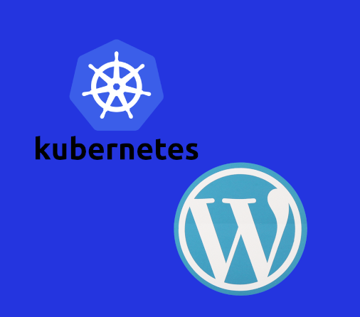

# Resolução de problemas: Kubernetes+Wordpress



Uma situação bem comum quando queremos fazer algo novo é experimentar, e para iniciar um negócio novo não é diferente, você acaba ganhando uma série de amostras grátis onde tudo é rápido, funcional, e após uma série de experimentações decide comprar, porém nem tudo era como as amostras e você precisa estar preparado para isso.

A situação descrita acima é bem recorrente para equipes pequenas que estão construindo um negócio e estão focadas em realizar inúmeras de maneira rápida. Neste post vou relatar um problema que passei que segue estas mesmas características.

Bom, existe um site que utiliza WordPress como gerenciador de conteúdo e que rodava no IBM Kubernetes Services no IBM cloud, ou seja, todo o WordPress estava rodando em container, algo ótimo devido a facilidade de instalação e futura escalabilidade do site.

Durante o período de experimentações utilizei o cluster free que a IBM Cloud fornece, afinal estava decidindo onde hospedaria a aplicação. Tudo funcionava perfeitamente, o site estava rápido, regras de escalabilidade foram estabelecidas, o domínio já estava funcionando e estava satisfeito com o serviço oferecido, logo decidi ir para a camada standard, e foi aí que ocorreram algumas mudanças.


Utilizando um cluster free é óbvio que ele é otimizado para que tudo seja rápido e funcional, e ao mudar para versão standard tive que implementar minhas próprias implementações para que tudo ficasse do jeito correto.

Estava usando este repositório para criar a aplicação [https://github.com/IBM/Scalable-WordPress-deployment-on-Kubernetes](https://github.com/IBM/Scalable-WordPress-deployment-on-Kubernetes). Analisando os yaml que são utilizados para construir o site, é possível notar que alguns tipos de serviços não seriam criados pelo kubernetes no cluster free, como por exemplo a criação de volumes para armazenar persistentemente os dados do site, porém no cluster standard foram criados.

O problema da aplicação consistia no seguinte, o painel de admin do WordPress que no cluster free era rápido, agora estava levando por volta de 20 segundo para carregar, algo que impossibilitava a utilização do blog e necessitava de muita paciência dos editores para fazer uma simples postagem. A página inicial do site também estava lenta mas tinha sido resolvido com plugin de cache. Contudo, a natureza do problema revelou que era algo generalizado e não especifico da tela de admin.

O problema era que a criação de volumes para o WordPress estava especificada para apenas ler o disco e gravar apenas uma vez e somando a isso de acordo com a documentação a taxa de acesso a memória seria de 2 iops/GB, ou seja, como eu estava usando 20GB poderia acessar a memória 40 vezes por segundo, considerando que a taxa de acesso para uma aplicação pequena seja em média de 4000 iops resultaria numa taxa de transferência de 0,16MBps(4000*40 = 160000B), algo muito baixo e que refletia muito bem o problema.

```yaml
apiVersion:v1
kind:PersistentVolumeClaim
metadata:
 name: wp-lv-claim
 labels:
  app: wordpress
spec:
 accessModes:
  - ReadWriteOnce
  resources:
   requests:
    storage: 20Gi
```

Com o gargalo da aplicação encontrado, a forma como a aplicação acessa a memória e a taxa de leitura, o que foi feito foi alterar o yaml de criação dos volumes para ler e escrever várias vezes e aumentar a memória para 400GB, o que considerando as mesmas taxas citadas acima resultaria numa taxa de transferência de dados de 3,2MBps, algo superior ao estado anterior mas passível de ser melhorado utilizando uma annotation no yaml para mudar a classe de bronze, que o padrão da IBM, para gold, aumentando para 10 iops/GB, elevando a taxa para 16MBps, suprindo as necessidades da aplicação.

```yaml
apiVersion:v1
kind:PersistentVolumeClaim
metadata:
 name: wp-lv-claim
 annotations:
  volume.beta.kubernetes.io/storage-class: "ibm-file-gold"
 labels:
  app: wordpress
spec:
 accessModes:
  - ReadWriteMany
  resources:
   requests:
    storage: 400Gi
```

Com a alteração feita, o problema foi solucionado, logo o admin do WordPress passou a ser carregado em pouco menos de 1 segundo e a página principal não necessita mais de cache para ter um tempo de carregamento aceitável, algo entorno de 2 segundos.

É importante citar que toda a solução do problema passa por entender como o kubernetes funciona, pois a alteração em uma linha especifica, a respeito da quantidade dedicada ao armazenamento solucionou parte do problema; e como o ele interage com o hardware, dado que a inclusão de uma annotation no arquivo yaml otimizou a solução.

