# Como ter o seu Classificador de imagem rodando no IBM Cloud
#### Um pouco de teoria e prática para você entender como rodar seu modelo em nuvem


A classifacação de imagens constitui um grande campo de estudo dentro dos algoritmos de classificação, tornar máquinas capazes de entender a carateristica buscada para classificar corretamente a imagem constitui um grande desafio tecnológico tanto do ponto de vista de hardware e software.

Do ponto de vista de hardware, o processamento de imagens é custoso pois para que o algoritmo de classificação consiga extrair as características de uma determinada imagem é necessário analisar os pixels que a compõem, fazendo uma conta bem simples, uma imagem full HD de 1920x1080 resulta aproximadamente 2 milhões de pixel, e como cada pixel é formado por três conjuntos de bytes, um para cada canal RGB temos ao todo 6 milhões de bytes, o que resulta em algo próximo a 6MB da dado. Para uma imagem isso é normal, mas pensando num dataset com 1000 imagens acaba se tronando inviável sem uma GPU.

Ao se traballhar com processamento de imagens o uso de GPU pode ser um diferencial tremendo e nem sempre é facil e barato comprar e instalar uma GPU na sua máquina, nesse momento a computação em nuvem surge para democratizar o acesso a esses recurso de modo acessivel.

Sob a ótica de software, o desafio de classificar uma imagem é extrair caracteristicas dela de modo que algum algortimo seja capaz de classificar as imagens. Felizmente existe um grupo de técnicas bem conhecidas e já implementadas em bibliotecas aplamente utilizadas como Sckit-Learn, Tensorflow e Keras de modo a tornar a vida do desenvolvedor seja mais fácil.

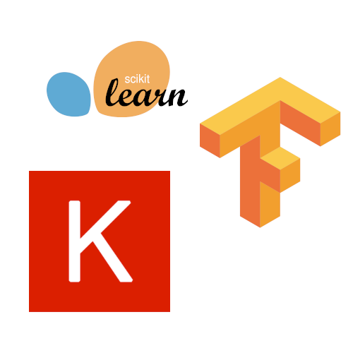

Dentro do escopo de algoritmos que buscam tornar um determinado sisterma inteligente por meio de aprendizado supervisionados

O aprendizado por classificação demanda por exemplos para que o algoritmo escolhido seja efetivo na identificação e extração da caraterística desejada, mais do que isso, é necessário que eles sejam de qualidade, e aqui podemos fazer uso de técnicas que realcem o atributo a ser extraído. Como o modelo a ser montado deve classifcar imagens, elas vão compor o dataset que servirá com *ground truth*, em outras palavras, o que se faz é dizer qual a classifiacação correta para cada imagem.

Ao se trabalhar com imagens podemos utiliza-las por inteiro, ou seja, utilizar todo o conteúdo dela, que inclui outros detalhes que podem ser irevelvantes para a classificação, porém podem ser prejudiciais ao processo de treinamento, por isso o mais adequado é recortar a imagem ao ponto de a característica base que classifique a imagem seja predominte.

Para exemplificar o pensamento acima vamos elaborar um modelo capaz de identificar se o animal possui chifres, este modelo vai identificar animais com e sem esta caracteristica. Agora num momento de reflexão, imagine quaquer animal que possua chifres, perceba que o atributo que o classifica é muito menor que o todo o corpo do animal, logo o recorte da área pode melhorar o modelo. Há situações que essa técnica pode não funcionar, neste caso uma análise sobre o que definie o objeto a ser classificado pode ajudar, caso nem isso seja o suficiente, o jeito é trabalhar com a imagem completa e verificar se as métricas dos modelos estão razoáveis, considere também fazer outras associações se possível como sensores.

Dentro dos modelos de classificação de imagens, a rede neural convolucional tem se destacado como ferramenta de classificação de imagens devido a sua estrutura, composta por filtros e uma rede neural tradicional. Da mesma forma que um filtro numa foto do instagram tem a função de realça-lá, o mesmo acontece com a rede neural, o que muda são apenas os valores dos filtros e como eles agem sobre a imagem.

A vantagem de se usar redes neurais convolucionais para classificar imagens é que durante a camada convolucional, a ação do filtro busca realçar a caracteristica a ser extraída, de modo que ao final o filtro treinado seja o mais adequado a situação, em outras palavras os valores dos filtros são adequados durante o processo de treinamento, bem com os pesos dos neuronios disparando e classificando determinada imagem.

Dentro do contexto de computação em nuvem aplicado a data science e a criação de modelos de I.A a solução que a IBM oferece é o Watson Studio, que na relidade é um ambiente montado para otimizar e agregar em um só lugar várias ferramentas para se trabalhar com esse tipo de aplicação.  Nele estão reunidos ferramentas como jupyter notebook, SPSS modeler, armazenamento para os dados.

Muito já foi discutido sobre a teoria de classificação de imagem e chegou a hora de sermos um pouco mais práticos. Vamos criar um simples classificador de animais num zoológico, focando nos seguintes animais: Elefante, Leão e Girafa, uma vez com o modelo pronto faremos o deploy do mesmo no Watson Machine Laerning, e pronto para ser consumido por sua aplicação.

Primeiramente é preciso ter as imagens que servirão de exemplo para o classificador. Será utilizando um script em python capaz de puxar 100 imagens de cada grupo de animal de uma vez, a biblioteca utilizada é a [google-images-download](https://github.com/hardikvasa/google-images-download) e o código se encontra a logo abaixo.

```python
from google_images_download import google_images_download

animals = ["Lion", "Elephant", "Giraffe"]

resp = google_images_download.googleimagesdownload()
for animal in animals:
    resp.download({"keywords": animal, "limit":100})
```

Após realizar o download começa o processo de limpeza, pois ao automatizar a tarefa por meio de um script é possível que venha muitas imagens invalidas, como por exemplo desenhos. Aqui também devemos buscar recortar a imagem ao ponto que o objeto a ser classficado preencha a maior parte da foto.

Após realizar o download e a limpeza do dataset as pastas devem ser renomeadas para os seguintes nomes: Lion, Elephant, Giraffe, repectivamente para a pasta com as imagens de leão, elefante e girafa. Ao final do processo compacte as três pastas em uma arquivo chamado DATASET.zip.

```bash
zip -r DATASET.zip Lion/ Giraffe/ Elephant/
```

Agora que os dataset já está formado e limpo, podemos começar a criar nosso modelo de calssificação de imagens. Para isso vamos utilizar o Watson Studio junto com o Watson Machine Learning, ambos os serviços se encontram disponíveis no catálogo do IBM Cloud, logo se você não tem uma conta lá acesse esse [link](https://cloud.ibm.com/registration) e crie uma agora mesmo.

Dentro do [catálogo](https://cloud.ibm.com/catalog?category=ai), localize os serviços disponibilizados na imagem abaixo pois eles serão utilizados ao longo deste artigo.


Primeiro instancie o Watson Machine Learning. Assim que ele estiver instanciado você deverá ver uma tela parecida com a imagem abaixo. No canto superior esquedo da tela clique em `Credenciais de Serviço`
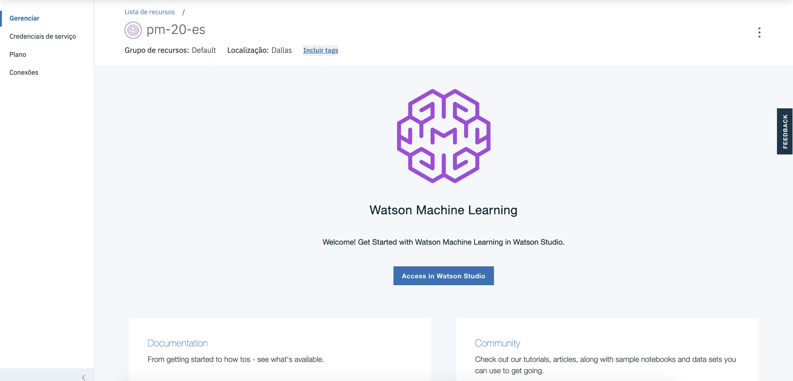

A tela que se abriu contêm as credenciais de acesso ao serviço, não se preocupe caso o seu seviço não tenha nenhuma credencial, você pode criar uma nova clicando no botão azul `Nova credencial`. Se já houver uma credencial basta clicar em `Visualizar credenciais` e copiar todo o conteúdo disponibilizado pois será utilizado ao longo do artigo.
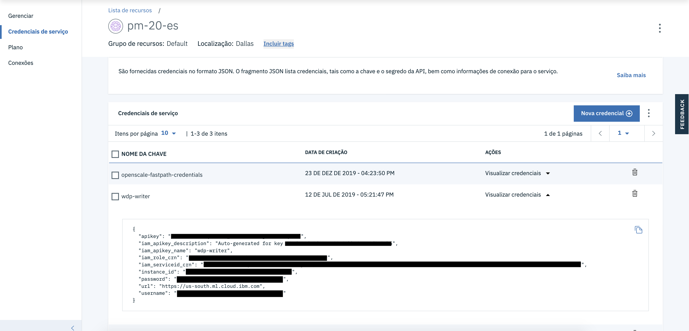

Agora volte ao catálogo e intancie e o Watson Studio. Uma vez com os dois serviços instânciados vamos acessar o Watson Studio, a tela inicial dele ver ser algo parecido com a imagem abaixo.


Vamos criar um novo projeto para que possamos criar nosso modelo de classificação.

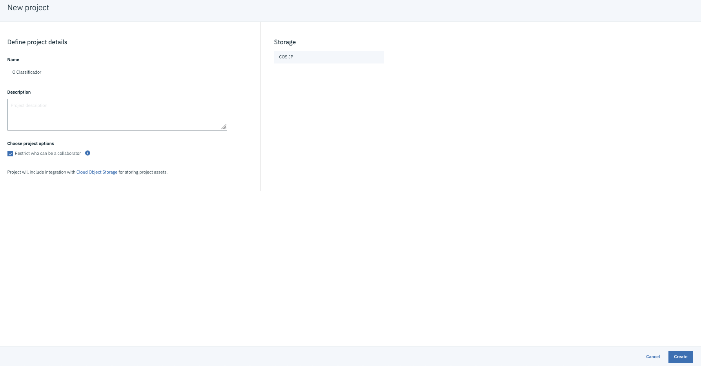

Após especificar o nome do projeto você será guiado para a tela inicial do Watson Studio, conforme mostra a proxima figura.

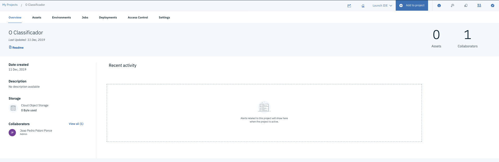

Agora vamos criar nosso notebook para criarmos nosso modelo. Para isso basta clicar em `Add to project` e em seguida `Notebook`.

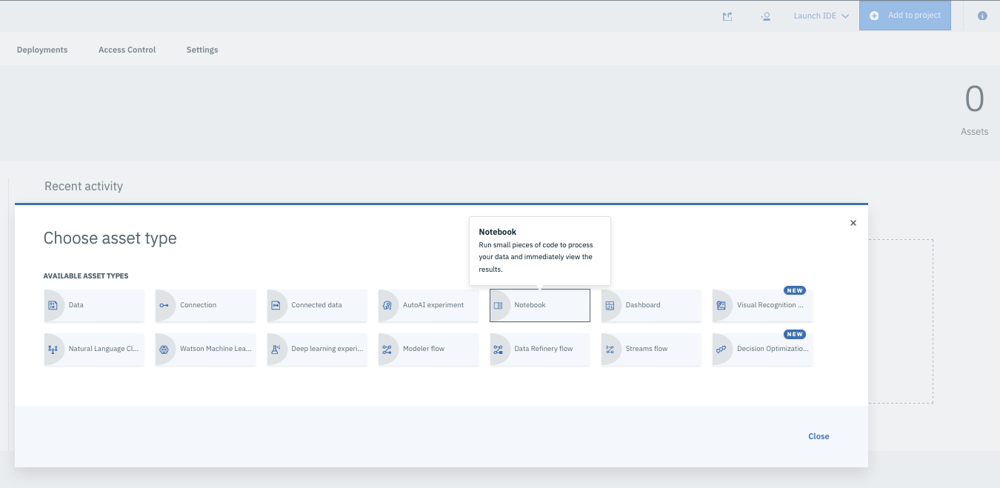

Agora vamos criar um jupyter notebook a partir de uma URL, dêem o nome que acherem mais adequado e colem a seguinte url no `Notebook URL` `https://raw.githubusercontent.com/JoaoPedroPP/Sky-Zoo/master/model-jupyter/skyzoo.ipynb`

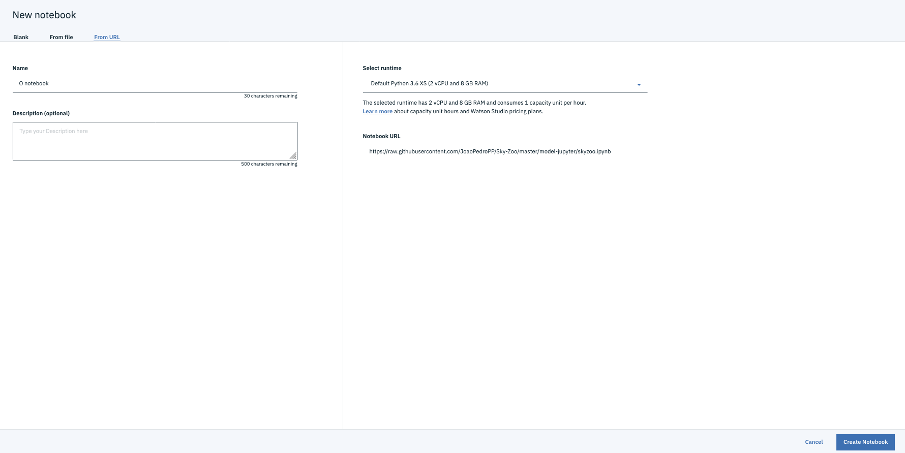

Assim que a página carregar deverá aparecer o notebook da imagem seguinte.


Pode rodar as células do notebook clicando no botão play ou através do atalho `Shift+Enter`.

Ao chegar na célula `Download do Dataset(imagens)`, pois aqui feremos o upload do nosso dataset e vamos inserir as credenciais de onde ele está armazenado. Primeiramente vamos fazer o upload do zip do dataset, para isso basta cliclar no botão 01010 localizado no canto superior esquerdo, selecionar o dataset e esperar pelo upload.

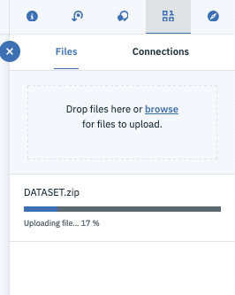

Assim que o dataset estiver disponível para uso teremos a opção de inserirmos suas credenciais na célula abaixo de modo que o resultado final corresponda as duas imagens abaixo.

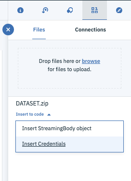

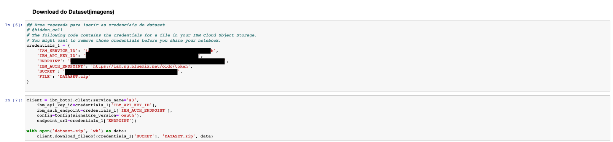

Agora continue rodando cada célula até chegar na de título `Watson Machine Learning Credentials`, conforme mostra a imagem abaixo.
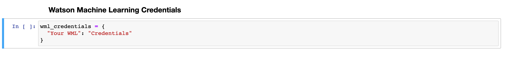

Nesta célula cole as credenciais do serviço do Watson Machine Learning conforme mostrea a imagem abaixo e execute a operação contida nela.
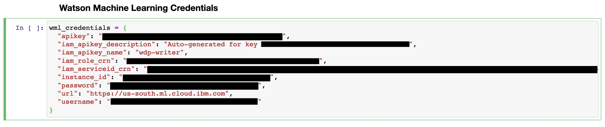

Após executar a célula o deploy do modelo para o Watson Machine Learning deve ter sido realizado e deverá mostrar a url de acesso ao modelo. Agora temoc um modelo customizado de classificação de imagens disponível por meio de uma API.
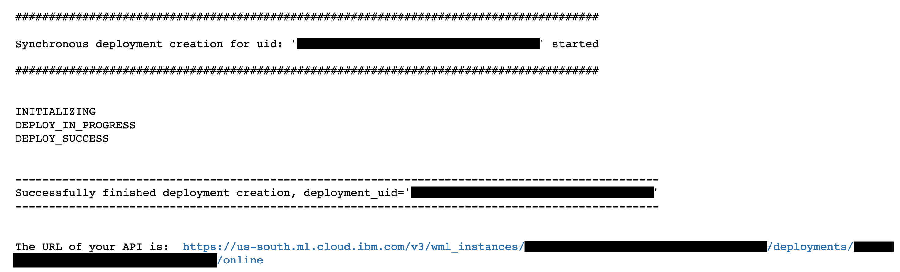

Após isso resta apenas uma célula a ser executada, ela basicamente testa o modelo com uma imagem que você pode selecionar dentro do dataset.
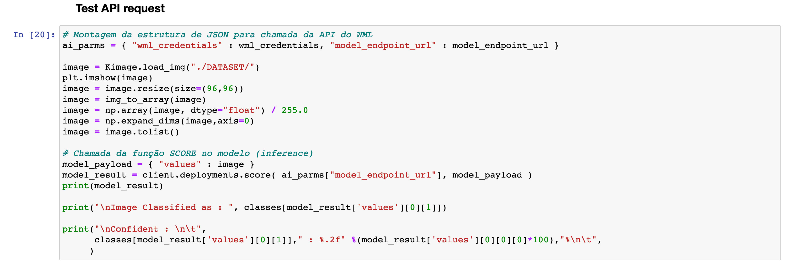

Com o fim do jupyter notebook esse artigo está completo, pois agora temos um modelo de classificação criado e sendo executado em nuvem com apenas uma chamada de api de distância para ser consumido. O próximo passo para o desenvolvedor é criar uma aplicação capaz de consumir a api criada, para isso no mesmo local onde pegamos e jupyter notebook existe uma aplicação interia que consome este modelo e está documenta para que seja possivel fazer o deploy dela no IBM Cloud. Aproveite e divirta-se.

